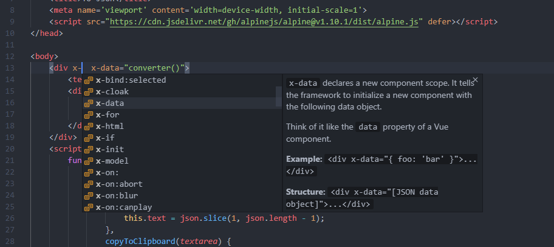
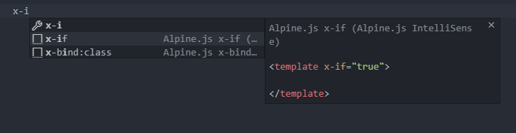

# Alpine.js IntelliSense

Simple IntelliSense & Snippets for [Alpine.js](https://github.com/alpinejs/alpine) framework.

## IntelliSense

IntelliSense for Alpine's directives.

## Snippets

| Prefix | Body |
| ------ | ---- |
| x\-if | `<template x-if="${1:true}"> $0 </template>` |
| x\-for | `<template x-for="${1:item} in ${2:items}"> $0 </template>` |
| x\-for\-key | `<template x-for="${1:item} in ${2:items}" :key="${3:item}"> $0 </template>` |
| x\-for\-index | `<template x-for="(${1:item}, ${2:index}) in ${3:items}" :key="$2"> $0 </template>` |
| x\-bind:class | `x-bind:class="{ '${1:hidden}': ${2:foo} }"` |
| x\-bind | `x-bind:${1:attribute}="${2:expression}"` |
| x\-show | `x-show="$0"` |
| x\-transition:enter | `x-transition:enter="$0"` |
| x\-transition:enter-start | `x-transition:enter-start="$0"` |
| x\-transition:enter-end | `x-transition:enter-end="$0"` |
| x\-transition:leave | `x-transition:leave="$0"` |
| x\-transition:leave-start | `x-transition:leave-start="$0"` |
| x\-transition:leave-end | `x-transition:leave-end="$0"` |
| $el | `$el` |
| $refs | `$refs.${1:name}` |
| $event | `$event` |
| $dispatch | `$dispatch('${1:custom-event}', ${2:{ foo: 'bar' }})` |
| $nextTick | `$nextTick(${1:() => { console.log($event.target.innerText) }});` |
| $watch | `$watch('${1:open}', ${2:value => console.log(value)})` |
| \.away | `.away` |
| \.prevent | `.prevent` |
| \.stop | `.stop` |
| \.window | `.window` |
| \.document | `.document` |
| \.once | `.once` |
| \.debounce | `.debounce.${1:750}` |
| \.transition | `.transition` |
| alpine\-cdn | `` |